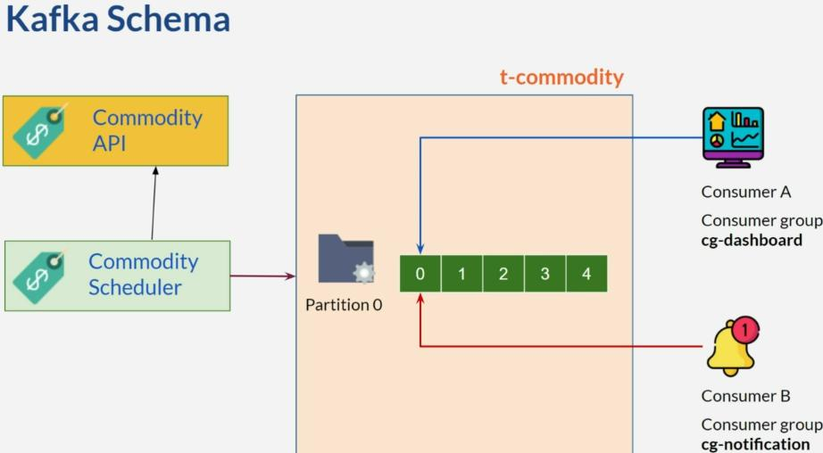
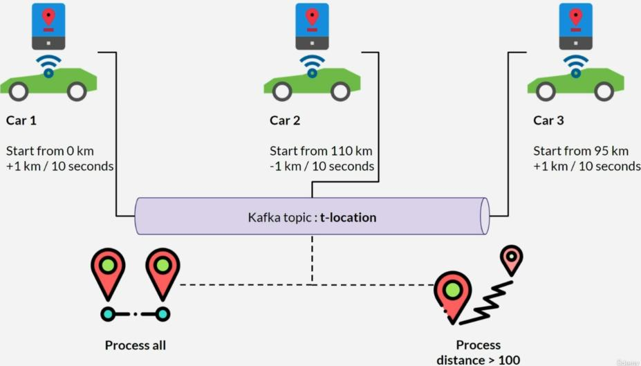
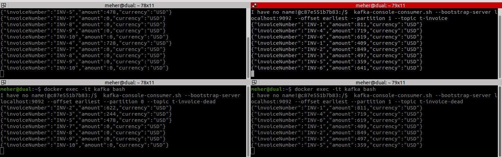
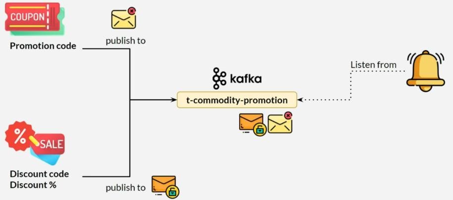

# Java Spring & Apache Kafka Bootcamp - From Fundamentals to Advanced

Welcome to the **Java Spring & Apache Kafka Bootcamp - From Fundamentals to Advanced** project!

This bootcamp is designed to provide a comprehensive understanding of Java Spring and Apache Kafka, covering the core
concepts to advanced techniques.
Whether you're a beginner looking to learn these technologies from scratch or an experienced developer seeking to
enhance your skills, this bootcamp
has got you covered.

## Features

- In-depth explanation of Java Spring fundamentals, including dependency injection, inversion of control, and Spring
  MVC.
- Hands-on projects and exercises to reinforce your learning and practical skills.
- Introduction to Apache Kafka and its role in building scalable, event-driven applications.
- Building real-world applications using Java Spring and Apache Kafka together.
- Detailed tutorials and guides to help you navigate through the bootcamp materials.

## Prerequisites

To get the most out of this bootcamp, it is recommended to have prior knowledge of Java programming. Familiarity with
basic concepts like object-oriented programming and Java syntax will be beneficial. Some understanding of web
development and REST APIs will also be helpful.

## Getting Started

To start learning with the **Java Spring & Apache Kafka Bootcamp - From Fundamentals to Advanced**, clone or download
this repository to your local machine. Follow the instructions provided in the individual modules and projects to
progress through the bootcamp. Feel free to reach out if you have any questions or need assistance.

Let's embark on this learning journey together and become proficient in Java Spring and Apache Kafka!

## Apache Kafka

Apache Kafka is an open-source distributed event streaming platform for real-time data streaming.

### Key Features and Concepts

- **Event Streaming Platform**: Apache Kafka enables real-time data streaming.

- **Topics**: Organize data streams into topics, allowing producers to publish messages and consumers to subscribe and
  consume those messages.

- **Publish-Subscribe Model**: Follows the publish-subscribe messaging pattern, enabling parallel processing and
  scaling.

- **Brokers**: Operates in a distributed architecture with multiple brokers forming a cluster, providing fault tolerance
  and scalability.

- **Partitions**: Divide topics into ordered and immutable partitions, allowing for parallelism and scalability across
  brokers.

- **Replication**: Replicate partitions across brokers for data durability and fault tolerance.

- **Producers**: Publish messages to Kafka topics, choosing the partition to write to.

- **Consumers**: Subscribe to Kafka topics and read messages, where multiple consumers can be part of a consumer group
  for scaling.

- **Streams**: Kafka Streams is a client library for stream processing and real-time analytics on data streams.

### Use Cases

Apache Kafka is commonly used for real-time data streaming applications, such as:

- Log aggregation
- Event sourcing
- Messaging systems
- Data pipelines
- Stream processing

To get started with Apache Kafka, refer to the
official [Apache Kafka documentation](https://kafka.apache.org/documentation/) for installation instructions, tutorials,
and detailed guides.Consumer is Real Time Indeed
### Kafka Basic Concepts:
<div style="center">

</div>

## 01 - Start Writing Codes
* We can use application.properties or application.yml,
I prefer yml format for readability it's optional
1. Part 1: Setup kafka Producer and Consumer
2. Docker Compose commands:
   * Start containers
     ```
        docker-compose -f docker-compose-core.yml -p core up -d
        docker-compose -f docker-compose-connect.yml -p connect up -d
        docker-compose -f docker-compose-connect-sample.yml -p connect-sample up -d
        docker-compose -f docker-compose-full.yml -p full up -d
        docker-compose -f docker-compose-full-sample.yml -p full-sample up -d
     ```
   * Stop containers :
      - docker-compose -f [script-file] -p [project] down
        ``` 
         docker-compose -f docker-compose-core.yml -p core down
         docker-compose -f docker-compose-connect.yml -p connect down
         docker-compose -f docker-compose-connect-sample.yml -p connect-sample down
         docker-compose -f docker-compose-full.yml -p full down
         docker-compose -f docker-compose-full-sample.yml -p full-sample down
        ```
   * The command ***"docker exec -it kafka bash"*** is used to start an interactive bash shell session
inside a running Docker container named "kafka"
3. Hello kafka - Topic & Partition
   - Create hello topic:
   ```kafka-topics.sh --bootstrap-server localhost:9092 --create --partitions 1 --replication-factor 1 --topic t-hello```
   - Describe Topic:
     ```kafka-topics.sh --bootstrap-server localhost:9092 --describe --topic t-hello```
   - List Topics:
   ```kafka-topics.sh --bootstrap-server localhost:9092 --list```
4. Hello kafka - Producer/Consumer
5. Consumer is Real Time Indeed:
   - Create Topic t-fixedrate:
    ```kafka-topics.sh --bootstrap-server localhost:9092 --create --partitions 1 --replication-factor 1 --topic t-fixedrate```
6. Fixing Consumer - Consumer Offset on First Run
         <div style="center">
           
         </div>
   1. Create t-fixedrate-2 Topic
   2. In application.yml add ```auto-offset-reset: earliest``` 
   * Now we can get all data in the consumer from First Run
7. Producing Message With Key:
   ```kafka-topics.sh --bootstrap-server localhost:9092 --create --partitions 3 --replication-factor 1 --topic t-multi-partitions```
   * In each terminal :
   ```
     kafka-console-consumer.sh --bootstrap-server localhost:9092 --topic t-multi-partitions --offset earliest --partition 0
     kafka-console-consumer.sh --bootstrap-server localhost:9092 --topic t-multi-partitions --offset earliest --partition 1
     kafka-console-consumer.sh --bootstrap-server localhost:9092 --topic t-multi-partitions --offset earliest --partition 2
   ```
8. Multiple Consumers for Each Topic: ****concurrency = "4"****
   * Kafka Consumer ***Concurrency***: Creating multiple instances of a Kafka consumer application and assigned to different partitions within a consumer group,
allowing independent processing of messages from each partition and achieving parallel processing
## 02 -  Working with JSON Message
1. Adding jackson dependencies
2. Producing JSON Message:
   1. Create t-employee topic
   ```kafka-topics.sh --bootstrap-server localhost:9092 --create --partitions 1 --replication-factor 1 --topic t-employee```
   2. Create EmployeeJsonProducer class and check it by using:
   ```kafka-console-consumer.sh --bootstrap-server localhost:9092 --offset earliest --partition 0 --topic t-employee```
   3. Customize JSON Format
      1. Create t-employee-2 topic
      2. Customize JSON Format:
         * @JsonNaming(value = PropertyNamingStrategy.class): is a Jackson library annotation for Java that allows you to customize how Java class field/property names are mapped to JSON representation
during serialization and deserialization. It provides flexibility to convert names between Java objects and JSON formats.
      3. To check "Employee2JsonProducer.class"  it by using ```kafka-console-consumer.sh --bootstrap-server localhost:9092 --offset earliest --partition 0 --topic t-employee-2```
3. Consuming JSON Message:
   - Create ObjectMapper Bean, Employee class, add jackson: date-format: yyyy-MMM-dd to application.yml file
4. Consuming with Consumer Group:
        <div style="center">
          
        </div>
     1. **Create Producer**:
        1. Create t-commodity topic
        ```kafka-topics.sh --bootstrap-server localhost:9092 --create --partitions 1 --replication-factor 1 --topic t-commodity```
        2. Create CommodityService 
        3. Create CommodityAPI:
           1. Add ```implementation "org.springframework.boot:spring-boot-starter-web"``` this dependency
already has jackson library 
           2. Comment JsonConfig class
           3. Create CommodityAPI class and run producer look here ```http://localhost:8080/api/commodity/v1/all```
           4. Create CommodityProducer And CommodityScheduler
           5. To check producer: ```kafka-console-consumer.sh --bootstrap-server localhost:9092 --offset earliest --partition 0 --topic t-commodity```
     2. **Create Consumer**:
        1. Create CommodityDashboardConsumer and CommodityNotificationConsumer Consumer
        2. To see the group: ```kafka-consumer-groups.sh --bootstrap-server localhost:9092 --group cg-dashboard --describe```
        3. To rest offset: ```kafka-consumer-groups.sh --bootstrap-server localhost:9092 --group cg-dashboard --execute --reset-offsets --to-offset 10 --topic t-commodity:0```
5. Rebalancing:
   * Rebalancing: Automatic redistribution of partitions in a Kafka consumer group to ensure load balancing and fault tolerance.
   - ```kafka-topics.sh --bootstrap-server localhost:9092 --create --partitions 1 --replication-factor 1 --topic t-rebalance```
6. Kafka Configuration
7. Message Filter
   - ```kafka-topics.sh --bootstrap-server localhost:9092 --create --partitions 1 --replication-factor 1 --topic t-location```
         <div style="center">
           
         </div>
   - containerFactory: Configures message listener containers for consuming Kafka messages in Spring applications.
   - By using ***containerFactory="farLocationContainerFactory"*** We filter the list of cars within the range of 1 to 100
and return the cars located farthest away, up to 100 km.
8. Idempotency
   - ```kafka-topics.sh --bootstrap-server localhost:9092 --create --partitions 1 --replication-factor 1 --topic t-purchase-request```
   - ```kafka-console-consumer.sh --bootstrap-server localhost:9092 --offset earliest --partition 0 --topic t-purchase-request```
9. Idempotency - Alternative 
   - ```kafka-topics.sh --bootstrap-server localhost:9092 --create --partitions 1 --replication-factor 1 --topic t-payment-request```
   - ```kafka-console-consumer.sh --bootstrap-server localhost:9092 --offset earliest --partition 0 --topic t-payment-request```
## 03 - Handling Exception
1. Handling Exception on @KafkaListener
   - ```kafka-topics.sh --bootstrap-server localhost:9092 --create --partitions 1 --replication-factor 1 --topic t-food-order```
   -  @KafkaListener(topics = "t-food-order", errorHandler = "myFoodOrderErrorHandler")
2. Global Error Handler:
   ```kafka-topics.sh --bootstrap-server localhost:9092 --create --partitions 1 --replication-factor 1 --topic t-simple-number```
3. Retrying Consumer:
   ```kafka-topics.sh --bootstrap-server localhost:9092 --create --partitions 2 --replication-factor 1 --topic t-image```
4. Dead Letter Topic (Dead Letter Queues):
   * A designated topic where messages that cannot be processed are sent for further analysis or handling.
   * Scenario: 
     - Publish to t-invoice
     - If amount is less than one, throw exception
     - Retry 5 times
     - After 5 failed retry attempts, publish to t-invoice-dead
     - Another consumer will consume from t-invoice-dead
     - ```
       kafka-topics.sh --bootstrap-server localhost:9092 --create --partitions 2 --replication-factor 1 --topic t-invoice
       kafka-topics.sh --bootstrap-server localhost:9092 --create --partitions 2 --replication-factor 1 --topic t-invoice-dead
       
       kafka-console-consumer.sh --bootstrap-server localhost:9092 --offset earliest --partition 0 --topic t-invoice
       kafka-console-consumer.sh --bootstrap-server localhost:9092 --offset earliest --partition 0 --topic t-invoice-dead
        kafka-console-consumer.sh --bootstrap-server localhost:9092 --offset earliest --partition 1 --topic t-invoice
       kafka-console-consumer.sh --bootstrap-server localhost:9092 --offset earliest --partition 1 --topic t-invoice-dead
       ```
       -  <div style="center">
           
          </div>
5. Non Blocking Retry 
   ```kafka-topics.sh --bootstrap-server localhost:9092 --create --partitions 2 --replication-factor 1 --topic t-image-2```
6. Scheduling Consumer
    ```
    kafka-topics.sh --bootstrap-server localhost:9092 --create --partitions 1 --replication-factor 1 --topic t-general-ledger
    kafka-console-consumer.sh --bootstrap-server localhost:9092 --from-beginning --topic t-general-ledger
    ```
    * Using ***KafkaListenerEndpointRegistry***
## 04 - Kafka in Microservice Architecture & Pattern
1. Creation of the four services: order, pattern, reward And storage 
2. Automatic Create Topics From Code
3. Order App: 
   1. Database
   2. kafka Producer
   3. Handle Kafka Publish Result - Kafka Producer Callback  
   4. We create distinct packages – API, Request, Response, Server, and Command –
encompassing various mechanisms and functionalities.
   5. Test the App:
      - To check consumer: ```kafka-console-consumer.sh --bootstrap-server localhost:9092 --from-beginning --topic t-commodity-order```
      - Postman: use "Order 1 Random Item" request inside Commodity Order folder
   6. Promotion Publisher:
      - ```kafka-topics.sh --bootstrap-server localhost:9092 --create --partitions 1 --replication-factor 1 --topic t-commodity-promotion```
      - Postman: use "Create promotion" request inside folder.
      - ```kafka-console-consumer.sh --bootstrap-server localhost:9092 --from-beginning --topic t-commodity-promotion```
   7. Promotion & Discount:
      1. Create discount mechanisms
   8. To filter bonus by branch we're using ***Header***
   - Add Header To Kafka Message:
      <div style="center">
          
      </div>
4. Pattern App:
   1. Kafka Consumer
5. Storage App:
    * Kafka Consumer: Listen two type of publisher (Promotion & Discount):
         <div style="center">
          
         </div>
    * Using ***@KafkaListener(topics = "t-commodity-promotion")*** Annotation at the PromotionConsumer class level.
    * The two methods are annotated with @KafkaHandler
    * Postman: you can use "Create promotion" and "Create Discount" requests inside Promotion and Discount folders.
6. Reward App:
   * Kafka Consumer: get ***Header*** from kafka Order message
   * Using Caffeine Cache dependency in Storage App gradle setting to save promotion and discount code in cache
   * Postman: use "Order 1 Random Item" request inside Commodity Order folder
